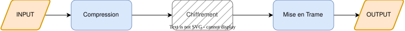

# GrandProjetCommunication_WP4

## Goal 
Le but est de concevoir un module python clef en main permettant de coder et décoder des informations dans le contexte du GP "Communication avec la Terre".

## Fonctions principales & Diagramme de flux

### Compression 
Envoyer des données étant un processus honéreux, il est bon de réduire la taille des données envoyés sans perte de qualité. 
Nous compressons le texte en entrée et le convertissons en binaire. Ce binaie et le dictionnaire de déchiffrement sera émis pour chaque texte. La compression aura lieu si elle est suffisament pertinente. 
Nous utiliserons la compression Huffman.

### Chiffrement 
### Mise en Trame 

