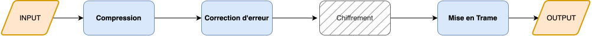

# GrandProjetCommunication_WP4

## Goal 
Le but est de concevoir un module python clef en main permettant de coder et décoder des informations dans le contexte du GP "Communication avec la Terre".

## Fonctions principales & Diagramme de flux

### Compression 
Envoyer des données étant un processus honéreux, il est bon de réduire la taille des données envoyés sans perte de qualité. 
Nous compressons le texte en entrée et le convertissons en binaire. Ce binaire et le dictionnaire de déchiffrement sera émis pour chaque texte. La compression aura lieu si elle est suffisament pertinente. 
Nous utiliserons la compression Huffman.

### Correction d'erreur
Encoder les donnees compresses en utilisant Reed-Solomon afin de proteger nos donnees du bruit. Reed-Solomon convertit blocs de donnees de k symboles et y ajoute des valeurs de controle supplementaires t et echantillonne courbe en un nombre de points plus eleve que le stricte necessaire. Le code peut corriger 2t + k = n erreurs maximum avec n etant le message total envoye. 

### Mise en Trame 
Couper la liste de données (maintenant chiffrées) en trames, pour pouvoir les envoyer. Ces trames sont toutes de la même longueur, 8 bits (ou des multiples de 8). Pour ce faire, nous allons coder une fonction parseuse, que l'on pourra éventuellement appeler lorsque nécessaire.

